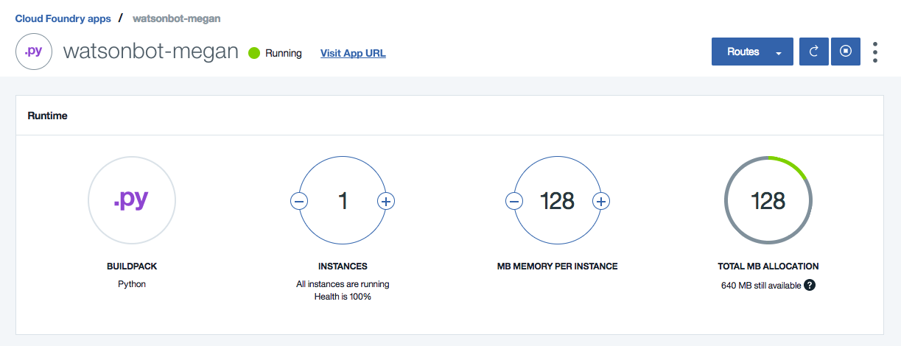

# watsonbot
**Watson Conversation Slack Bot**

Get started with the [Watson Conversation Service](https://console.bluemix.net/catalog/services/conversation) by creating your very own Slack Chat Bot. This demo will walk you through all of the necessary steps to configure your Watson Conversation service, set up your Slack bot, and deploy your application to Bluemix. You will be chatting with Watson in no time!

## Prerequistes
### Slack
* [Slack](https://slack.com)
* [Slack API](https://api.slack.com/)
  * Create a new [bot](https://api.slack.com/bot-users), you will be assigned a Slack API Token
  * Export your assigned Slack API Token
  
  ```
  $    export SLACK_BOT_TOKEN='<SLACK_BOT_TOKEN>'
  ```
  
  * Run the `print_bot_id.py` script
  
  ```
  $    python print_bot_id.py
  Bot ID for 'watsonbot' is <SLACK_BOT_ID>
  ```
  
  * Save both of these credentials for use later in this tutorial
  
### Bluemix
* [Bluemix Account](https://console.bluemix.net/)
* [Bluemix CLI](https://clis.ng.bluemix.net/ui/home.html)

### Git
* [Github Account](https://github.com)
* [Git](https://git-scm.com/downloads)

### Python
***Optional**: Only needed if running locally*
* [Python 2.7.x](https://www.python.org/downloads/)

## Steps
### Set up the Watson Conversation Service
1. See the [instructions](conversation/README.md) for setting up and configuring your [Watson Conversation Service](https://console.bluemix.net/catalog/services/conversation).

### Clone project and update for your Slack bot
1. Git clone this sample project

`$    git clone git@github.com:kostickm/watsonbot.git`

2. Change to your the newly cloned repo

`$    cd watsonbot/`

3. Copy the `env.sample` file to a new file named `.env`

```
# Windows
$    copy env.sample .env

# macOS/Linux
$    cp env.sample .env
```

4. Open and update the `.env`. file with your Slack credentials

```
# Slack
SLACK_BOT_TOKEN=<add_slack_bot_token>
SLACK_BOT_ID=<add_slack_bot_id>
```

5. Open and update the `.env`. file with your Watson Conversation credentials

```
# Watson conversation
CONVERSATION_USERNAME=<add_conversation_username>
CONVERSATION_PASSWORD=<add_conversation_password>
WORKSPACE_ID=<add_conversation_workspace>
```

6. Open the `manifest.yml` file and replace `<Your-App-Name>` with the unique name of your app

```
---
applications:
 - name: <Your-App-Name>
   domain: mybluemix.net
   memory: 128M
   health-check-type: none
   buildpack: https://github.com/cloudfoundry/buildpack-python.git
```

7. Open the `setup.py` file and replace `<Your-App-Name>`with the unique name of your app

```
# Always prefer setuptools over distutils
from setuptools import setup

long_description = ('This is a sample Watson Conversation Slack chat bot.')

setup(
    name='<Your-App-Name>',
    version='1.0.0',
    description='Watson Slack Chat Bot',
    long_description=long_description,
    license='Apache-2.0'
)
```

8. *Optional: Run locally to test*

`$    pip install -r requirements.txt`

`$    python watsonbot.py`

Chat with your `watsonbot` by sending a Slack message starting with `@watsonbot`.

### Deploy to Bluemix
You are now ready to deploy your application to Bluemix.

*Note: You may also use the shorthand command `bx` instead of `bluemix`.*

1. Log into Bluemix CLI using your Bluemix credentials

  `$    bluemix api https://api.ng.bluemix.net`

  `$    bluemix login`

2. From your local app directory deploy your app to Bluemix

  `$    bluemix app push`

### Chat with Watson
1. Check that your app is running in Bluemix



2. Test out your deployed app in Slack. Chat with your `watsonbot` by sending a Slack message starting with `@watsonbot`.

## Next Steps
* Check out the other Watson Python SDK [examples](https://github.com/watson-developer-cloud/python-sdk/tree/master/examples)
  * Add in the Watson Language Translation service
  * Add in the Watson Tone Analyzer service
* Incorporate an API (Weather, Calendar, Github, etc.)
* Have Watson tell a joke
