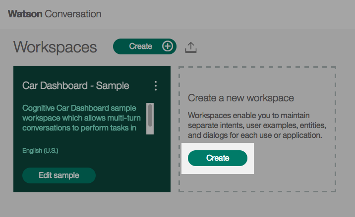
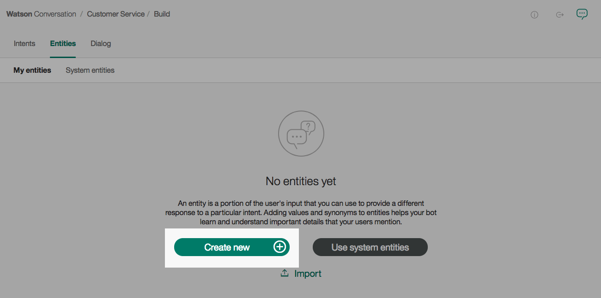

# watsonbot
Watson Conversation Slack Bot

## Prerequistes
### Slack
* [Slack](https://slack.com)
* [Slack API](https://api.slack.com/) - Create a bot

### Bluemix
* [Bluemix Account](https://console.bluemix.net/)
* [Bluemix CLI](https://clis.ng.bluemix.net/ui/home.html)

### Python
* [Python 2.7.x](https://www.python.org/downloads/)
* slackclient: `pip install slackclient`

### Git
* [Github Account](https://github.com)
* [Git](https://git-scm.com/downloads)

## Steps
### Set up the Watson Conversation Service
1. Create an instance of the [Watson Conversation Service](https://console.bluemix.net/catalog/services/conversation) in Bluemix.

  * Give the service a unique name and click **Create**.
  
  

2. Once your new Conversation Service is created, click **Launch tool** to start working with your Conversation Service.

  

3. Click **Create** to create a new Workspace.

  
  
  * Give the new Workspace a name and description. Click **Create**.
    
  
  
  * Once the workspace is created, you will see three tabs labeled: **Intents**, **Entities**, and **Dialog**.

4. From the Intents tab, click **Create new**.

  
  
  * Intents define the various types of user input to expect.
  
  * Start by creating a **greetings** Intent. Add typical greetings similar to the ones listed below.
  
  
  
  * Create a **complaint** Intent.
  
  
  
  * Create a **return** Intent
  
  
  
  * Finish up your Intents by adding a **goodbyes** and **anything_else** Intent.
  
  
  
  * The goal of the **anything_else** Intent is to catch random user input that is unexpected.
  
5. From the Entities tab, click **Create new**.

  
  
  * Entities further break down specific pieces of an Intent, allowing your bot to respond to each particular case.
  
  * Name your Entity **returnItems**, and add various various values and synonyms to your Entity.
  
  

6. From the Dialog tab, click **Create**.

  
  
  * The Dialog connects the Intents and Entities into a conversation based on user input and your bot's responses.
  
  * Start with creating the **Welcome** card. The trigger is **#greetings**, and enter a response for Watson.
  
  
  
  * Your **Welcome** card will now appear as follows.
  
  
  
  * Below the **Welcome** card, click the plus sign and create a **Complaint** card. The trigger is **#complaint**, and enter a response for Watson.
  
  * Below the **Compaint** card, click the plus sign and create a **Return** card. The trigger is **#return**, and in this case Watson will respond conditionally based on the Entities created. You specific the Entity condition as **@<entity_name>:<specific_entity_value>**.
  
  
  
  * Your **Return** card will now appear as follows.
  
  
  
  * Finish up your Dialog by adding a **Goodbye** card and an **Anything else** card.
  
  

7. You can test out your Dialog in the browser by chatting with Watson.

  * Click the chat bubble located in the top right corner of your Watson Conversation workspace.
  
  

  * Try chatting with Watson and see how your Dialog flows.
  
  
  
8. For the next part of this demo you will need to copy some service credentials.

  * Click the **Back to workspaces** button from the left-side menu.
  
  
  
  * Click the drop down menu on your Workspace and click **View details**.
  
  
  
  * Copy the **Workspace ID** for future use.
  
  
  
  * Return to your Bluemix Dashboard and click on your Conversation service.
  
  * From the left-side menu, click **Service Credentials**.
  
  * Expand the **View credentials** twisty and copy the `username` and `password`.
  
  

### Clone project and update for Slack bot
1. Git clone this sample project

`git clone git@github.com:kostickm/watsonbot.git`

2. Copy the `env.sample` file to `.env`
3. Update slack credentials
4. Update Watson Conversation credentials
5. *Optional: Run locally to test*

### Deploy to Bluemix
1. Log into Bluemix/CF CLI

  `bluemix api https://api.ng.bluemix.net`
  
  `bluemix login`
  
2. Push app to Bluemix

  `bluemix app push <app_name>`

### Chat with Watson
1. Check that app is running in Bluemix
2. Test out deployed app in Slack

## Next Steps
* Check out [Watson Python SDK](https://github.com/watson-developer-cloud/python-sdk/tree/master/examples) examples
* Add in Watson Language Translation
* Add in Watson Tone Analyzer
* Incorporate an API
* Have Watson tell some jokes
