# Watson Conversation Service

An example of setting up the Watson Conversation service for use in a chat bot. Feel free to change the content of your chat bot and be creative!

### Set up the Watson Conversation Service
1. Create an instance of the [Watson Conversation Service](https://console.bluemix.net/catalog/services/conversation) in Bluemix.

  * Give the service a unique name and click **Create**.

  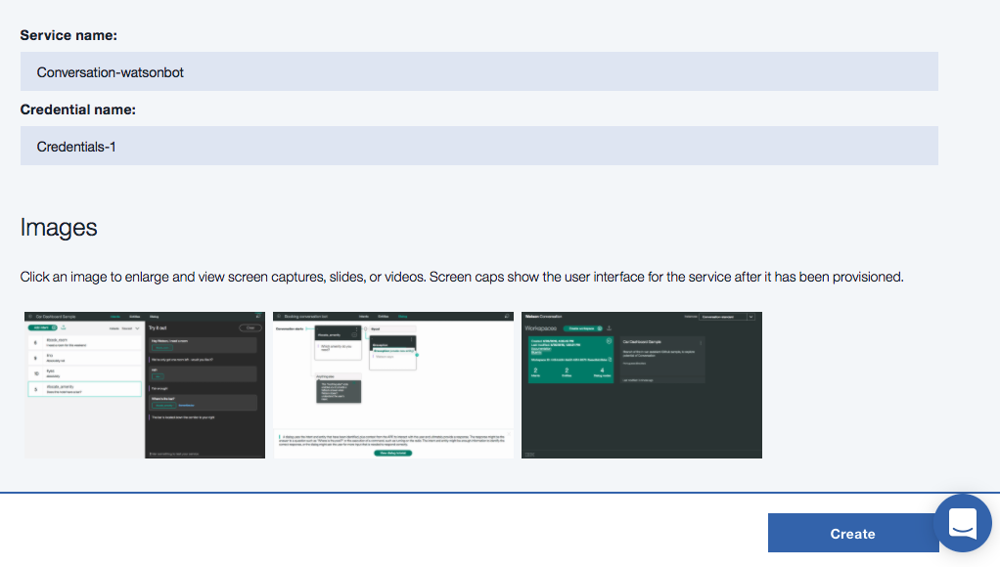

2. Once your new Conversation Service is created, click **Launch tool** to start working with your Conversation Service.

  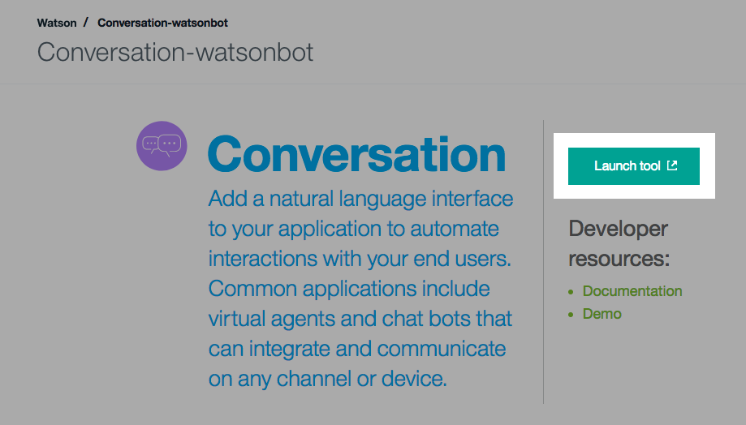

3. Click **Create** to create a new Workspace.

  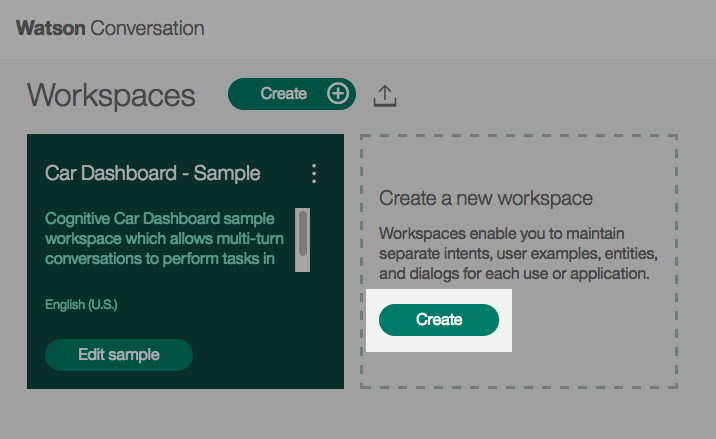

  * Give the new Workspace a name and description. Click **Create**.

  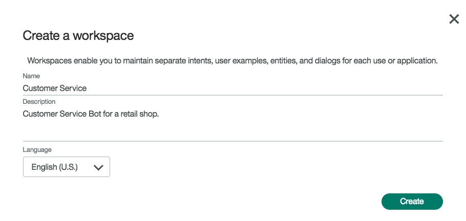

  * Once the workspace is created, you will see three tabs labeled: **Intents**, **Entities**, and **Dialog**.

4. From the Intents tab, click **Create new**.

  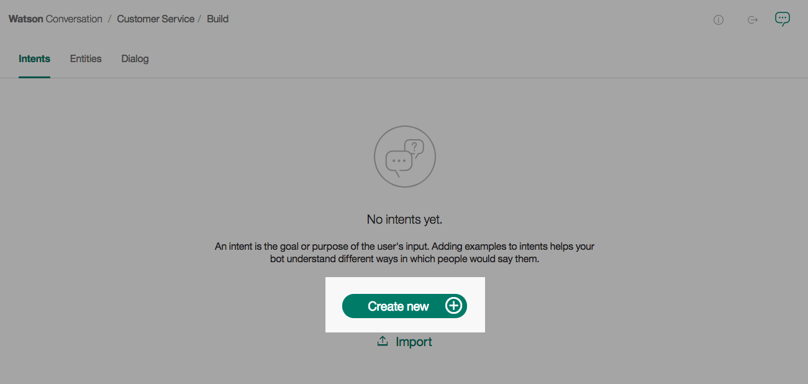

  * Intents define the various types of user input to expect.

  * Start by creating a **greetings** Intent. Add typical greetings similar to the ones listed below.

  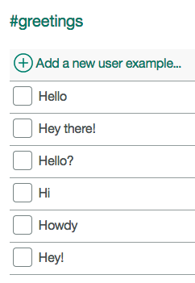

  * Create a **complaint** Intent.

  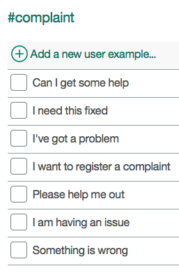

  * Create a **return** Intent

  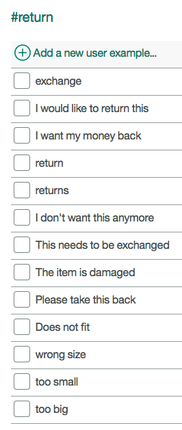

  * Finish up your Intents by adding a **goodbyes** and **anything_else** Intent.

  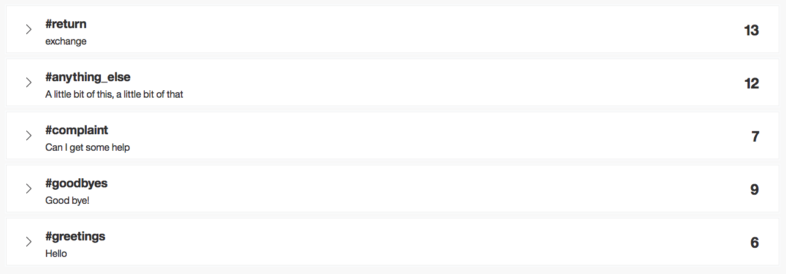

  * The goal of the **anything_else** Intent is to catch random user input that is unexpected.

5. From the Entities tab, click **Create new**.

  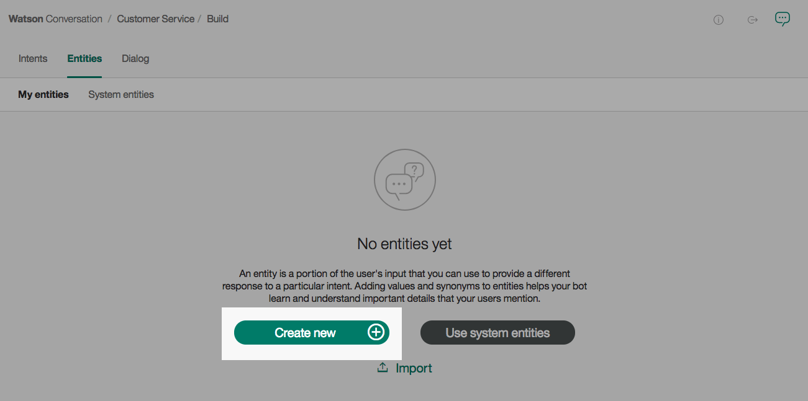

  * Entities further break down specific pieces of an Intent, allowing your bot to respond to each particular case.

  * Name your Entity **returnItems**, and add various various values and synonyms to your Entity.

  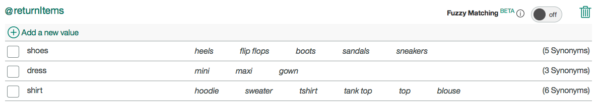

6. From the Dialog tab, click **Create**.

  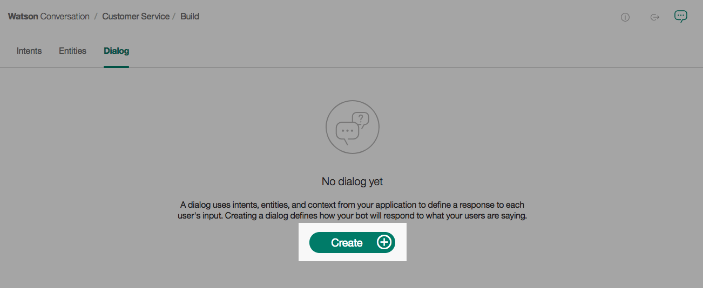

  * The Dialog connects the Intents and Entities into a conversation based on user input and your bot's responses.

  * Start with creating the **Welcome** card. The trigger is **#greetings**, and enter a response for Watson.

  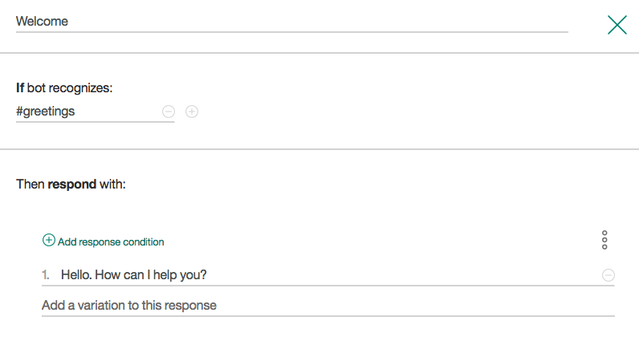

  * Your **Welcome** card will now appear as follows.

  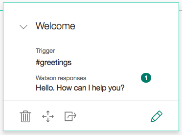

  * Below the **Welcome** card, click the plus sign and create a **Complaint** card. The trigger is **#complaint**, and enter a response for Watson.

  * Below the **Compaint** card, click the plus sign and create a **Return** card. The trigger is **#return**, and in this case Watson will respond conditionally based on the Entities created. You specific the Entity condition as **@<entity_name>:<specific_entity_value>**.

  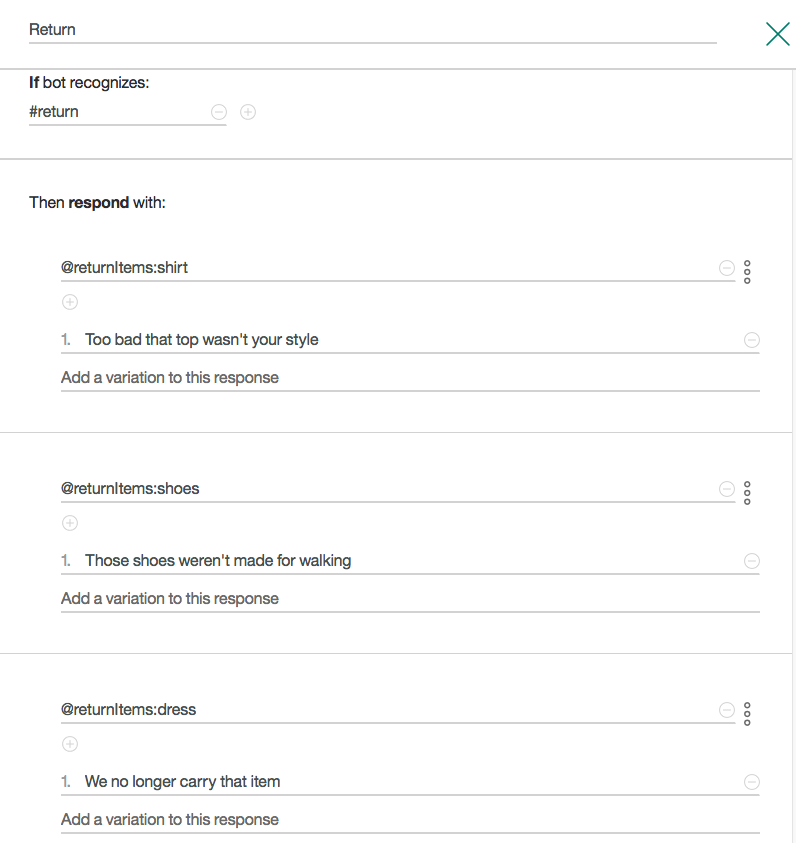

  * Your **Return** card will now appear as follows.

  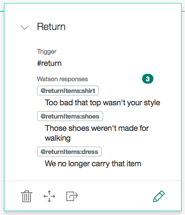

  * Finish up your Dialog by adding a **Goodbye** card and an **Anything else** card.

  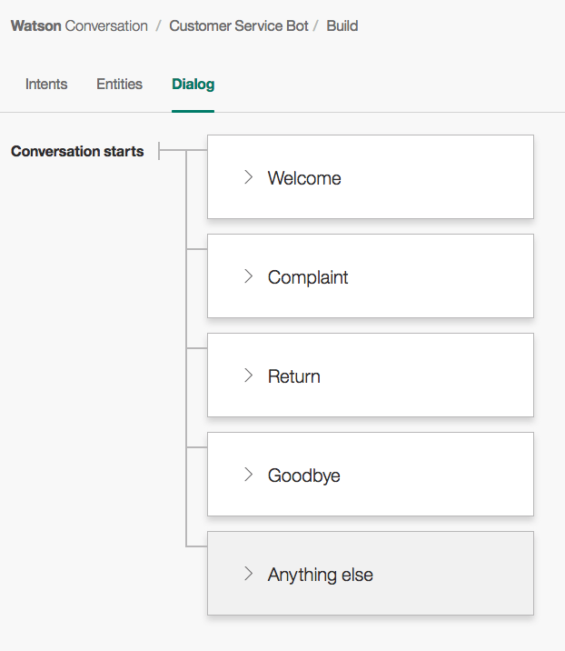

7. You can test out your Dialog in the browser by chatting with Watson.

  * Click the chat bubble located in the top right corner of your Watson Conversation workspace.

  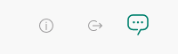

  * Try chatting with Watson and see how your Dialog flows.

  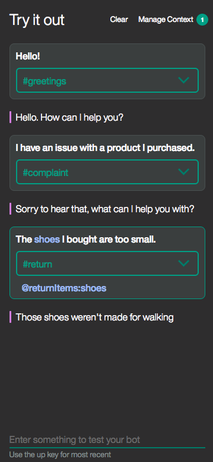

8. For the next part of this demo you will need to copy some service credentials.

  * Click the **Back to workspaces** button from the left-side menu.

  

  * Click the drop down menu on your Workspace and click **View details**.

  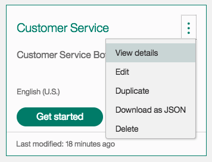

  * Copy the **Workspace ID** for future use.

  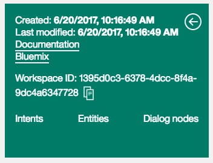

  * Return to your Bluemix Dashboard and click on your Conversation service.

  * From the left-side menu, click **Service Credentials**.

  * Expand the **View credentials** twisty and copy the `username` and `password`.

  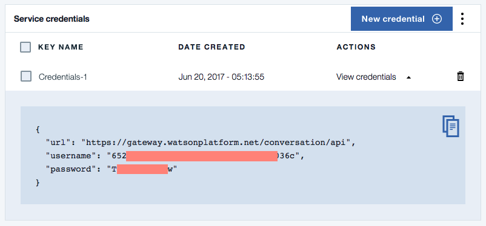
